## Spring @Transactional
##### <span style="font-family:Helvetica Neue; font-weight:bold"><span style="color:#e49436">@Transactional 자세하게 알아보기</span> </span>

<div style="text-align: right; margin-top:30px;">
_임성묵_
</div>
---


#### 사전지식 - Quiz

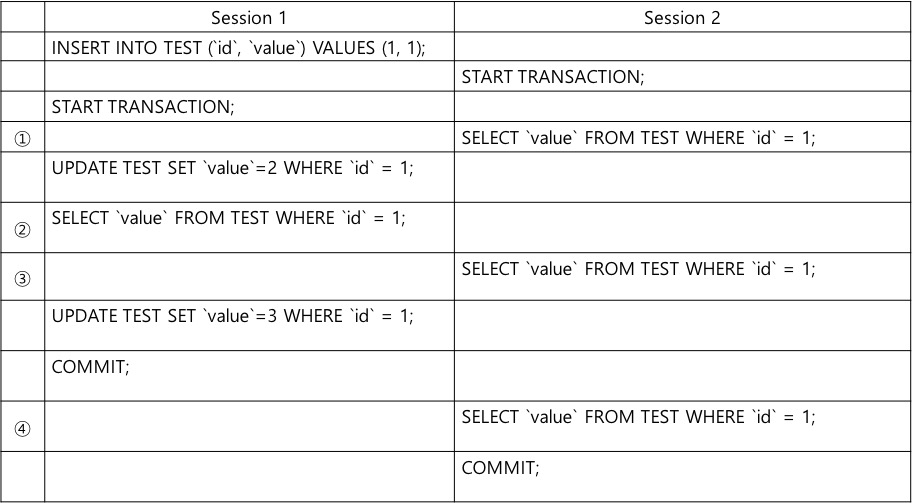

<span style="font-size: 80%;">
MySQL InnoDB 에서 두 세션으로 각각의 쿼리를 실행했을 때의 결과를 맞춰주세요
</span>

---

정답 : 1, 2, 1, 1 <br />
풀이 : MySQL InnoDB 는 Repeatable Read 이기 때문에 트랜잭션 내에선 read 값이 변경되지 않는다. <br />
자세한 설명은 뒷장에서...
문제 의도 : 트랜잭션을 제대로 사용하려면 코드 구현 뿐만 아니라 DBMS 기본 정책도 인지해야한다
---


### ANSI Isolation Levels

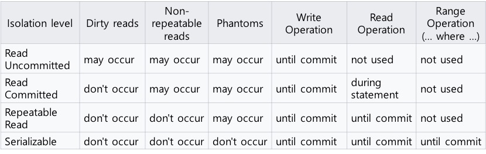

- ANSI 표준에서의 네 가지 Isolation
- 성능 : 위에서 아래 방향 순서로 좋다
- 안정성 : 아래에서 위 방향 순서로 동시 작업에서 안정성을 보장한다

---

### Isolation - Read Uncommitted


<div style="margin-top:-40px;">
    <span style="font-size: 80%">
    트랜잭션 내에서 다른 세션에서 *변경중인 데이터*를 읽을 수 있다 <br />
    (트랜잭션 진행 중 commit 하지 않은 변경사항 READ)
    </span>
</div>

---

### Isolation - Read Committed

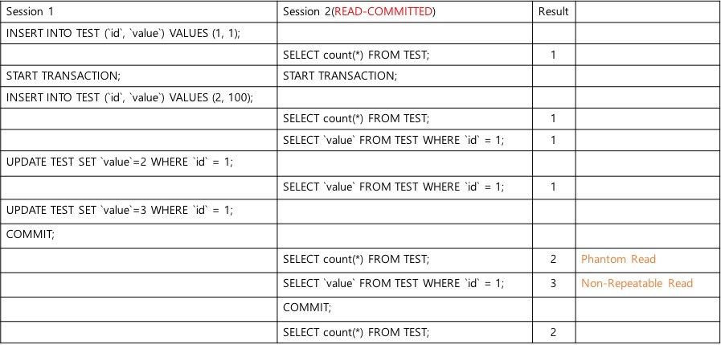

<div style="margin-top:-40px;">
    <span style="font-size: 80%">
    트랜잭션 내에선 커밋된 데이터만 읽어온다 <br />
    </span>
</div>

---

### Isolation - Repeatable Read(InnoDB 기본)

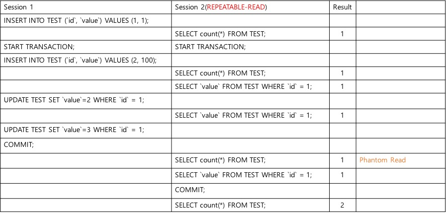

<div style="margin-top:-40px;">
    <span style="font-size: 80%">
    트랜잭션 안에선 select 몇 번을 하더라도 동일한 데이터가 나온다. <br />
    (다른 세션에서 commit 해도 동일한 값 리턴)
    </span>
</div>

---

### Isolation - Serializable

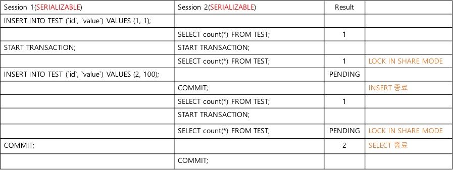
<div style="margin-top:-40px;">
    <span style="font-size: 80%">
    가장 강력한 안정성을 갖고 있다
    <br/>트랜잭션 내에선 Read 에도 자동으로 Lock 이 걸린다(InnoDB, Oracle 해당함)
    </span>
</div>

---

## Spring Dynamic Proxy

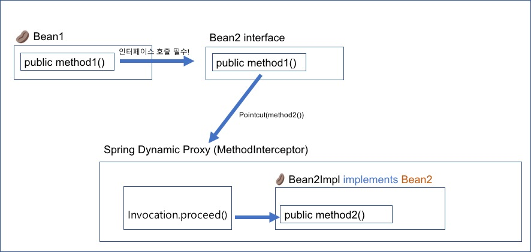

---?code=snippet/JdbcConnection.java&lang=java&title=JDBC Transaction

@[2](AutoCommit(false) 는 곧 START TRANSACTION 임)
@[4](정상 처리되면 commit)
@[5-6](문제 발생시 Rollback)
@[7-9](성공,실패 상관 없이 커넥션은 꼭 닫아줘야한다)

---?code=snippet/TransactionTemplate.java&lang=java&title=TransactionTemplate - Internal

@[9](Spring 에서 DI 된 transactionManager 로부터 트랜잭션을 가져온다)
@[12](콜백 클래스의 doInTransaction 을 실행한다)
@[14-28](Exception 발생 시 롤백을 진행한다)
@[29](Exception 이 발생하지 않았으면 commit 한다)


---?code=src/test/java/com/sungmook/transaction/template/TransactionTest.java&lang=java&title=Simple TransactionTemplate usage

@[72-73, 76-80](TransactionAutoConfiguration 에 의해 DI 받은 transactionTemplate 을 통해 실행)


---?code=src/test/java/com/sungmook/transaction/simple/TransactionTest.java&lang=java&title=Simple @Transactional usage

@[70-73, 79](@Transactional 적용)

---

### @Transactional Life Cycle - Database Transaction

1. @Transactional 어노테이션은 하나의 DB 트랜잭션 범위를 정의한다
1. DB 트랜잭션은 Persistent Context 내에서 수행된다

---

### @Transactional Life Cycle - Persistent Context

1. Persistent Context 는 하나의 EntityManager 로 수행되는 범위다
1. (EntityManager 는 내부적으로 하나의 하이버네이트 Session 을 사용함)
1. 자바 오브젝트의 변화를 추적하고 변경된 내용을 DB 에 반영하는 역할을 수행함
1. 컨텍스트에 여러개의 DB 트랜잭션이 있을 수 있다(open-in-view, PersistenceContextType.EXTENDED)


---

### EntityManager

1. Hibernate 를 Provider 로 사용한다면 1:1로 Session 을 갖고있다
1. 실행은 SharedEntityManagerInvocationHandler 를 통해 Proxy 로 수행된다
1. EntityManagerFactory 에 의해 트랜잭션 당 하나씩 만들어진다
1. Session 은 SessionFactory 에 의해 생성되며 DataSource 를 통한 Connection 을 갖고있다

---

### Transaction Manager - Responsibility

두 가지 책임이 있다
1. 새로운 EntityManager 를 생성할 것인가, 아니면 Share 해서 사용할 것인가
1. 새로운 DB 트랜잭션을 시작해야 하는가?

Transaction Aspect 의 'before' 에 호출되어 위 사항을 결정한다

---

### Transaction Manager - Start transaction

트랜잭션이 시작될 때 아래에 대한 책임이 있다
1. Holder 에 EntityManager, Connection 이 있으면 그대로 사용한다
1. 없으면 새로운 EntityManager 를 만든다
1. EntityManager 를 지금 속한 쓰레드에 Bind 한다
1. DB Connection pool(DataSource)로부터 Connection 을 가져온다
1. Connection 을 현재 쓰레드에 Bind 한다

---

### TransactionSynchronizationManager - Bind properties

1. TransactionManager 에서 가져온 두 ResourceHolder(EntityManager, Connection)를 ThreadLocal 에 저장
1. EntityManager Proxy(SharedEntityManagerInvocationHandler에서 invoke) 에서도 공유해서 사용
1. Open-in-view Interceptor 에서도 공유해서 사용

---

### Transaction Aspect (TransactionInterceptor)

1. @Transactional 이 설정된 Method 를 around 로 invoke 한다
1. 비즈니스 로직 수행 전(before) 에 새로운 트랜잭션을 수행할지, 기존 트랜잭션에 합류할지 정한다(TransactionManager 에 위임)
1. 비즈니스 로직 수행 후(after) 에 트랜잭션을 commit 할지 rollback 할지 결정한다

---

### Holders

1. EntityManagerHolder, ConnectionHolder
1. 쓰레드에서 공유(Share) 해서 사용하는 EntityManager, Connection 를 담아두는 홀더
1. Propagation.REQUIRED_NEW, NOT_SUPPORTS 에선 두 홀더에서 데이터를 잠시 제거한다
1. Open-in-view Interceptor 에서 하는 일은 미리 Holder 를 설정해놓고 Request 종료될때 제거함

---

### @EnableTransactionManagement

1. Annotation 으로 설정된 @Transactional 활성화
1. 기본은 Spring Proxy AOP, 즉 JDK 기본 Interface AOP 를 제공(설정으로 AspectJ 가능)
1. 내부 클래스 흐름은 <span style="font-size:50%">@EnableTransactionManagement -> TransactionManagementConfigurationSelector -> ProxyTransactionManagementConfiguration -> BeanFactoryTransactionAttributeSourceAdvisor
에서 PointCut 에 해당하는 @Transactional 정보를 갖고 있는 AnnotationTransactionAttributeSource 와 실제 Advice 를 수행하는 TransactionalInterceptor 가 Advisor 수행된다</span>


---

### Hibernate Proxy

1. Entity 접근 시 실제로는 HibernateProxy 를 통해 AOP 접근함
1. LazyLoading 은 Proxy 에 의해서 실제 불러들일 때만 DB 에서 Select 를 함
1. Proxy 에서 현재 쓰레드에 바인딩 된 EntityManager의 getReference({RelationClass.class}, PK) 호출
1. 트랜잭션 외부에서 관계가 설정된 데이터를 읽어올 때 LazyInitializationException 발생

---

### OpenEntityManagerInViewInterceptor
(Open-in-view)

1. Hibernate : Open Session In View. JPA : Open EntityManager In View
1. 요청(request) 시작 전에 미리 직접 EntityManager 를 생성, EntityManagerHolder 에 EntityManager 저장
1. 홀더는 실제 트랜잭션 매니저에서 그대로 활용
1. 요청(request) 종료 시 생성한 EntityManager 를 반환(close, remove)

---

### Application Transaction Propagation

- REQUIRED ( default )
- SUPPORTS
- MANDATORY
- REQUIRES_NEW
- NOT_SUPPORTED
- NEVER
- NESTED

---

### REQUIRED

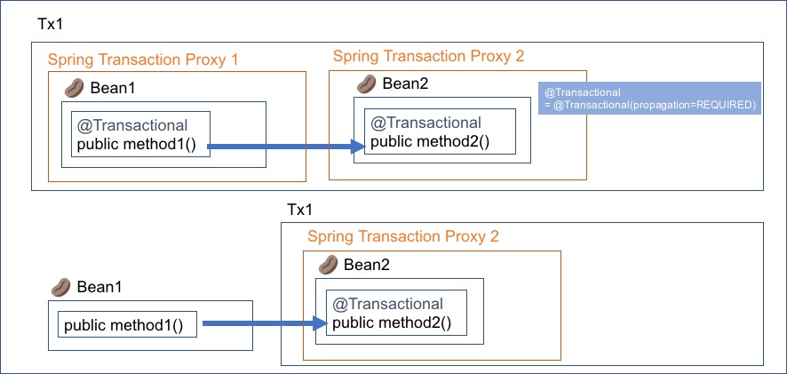

<ol>
<li style="font-size: 70%; color:white;">미리 시작된 트랜잭션이 있으면 참여하고 없으면 새로 시작한다</li>
<li style="font-size: 70%" color:white;>Spring 기본이며 대부분의 케이스엔 REQUIRED 면 충분하다</li>
<li style="font-size: 70%" color:white;>어디서든 Exception 이 발생하면 전체가 롤백된다</li>
</ol>

---

+++?code=src/test/java/com/sungmook/transaction/simple/TransactionTest.java&lang=java&title=REQUIRED @Transactional

@[52-57](try-catch 로 postService 에 발생한 RuntimeException 을 잡더라도 전체가 Rollback 된다)

---

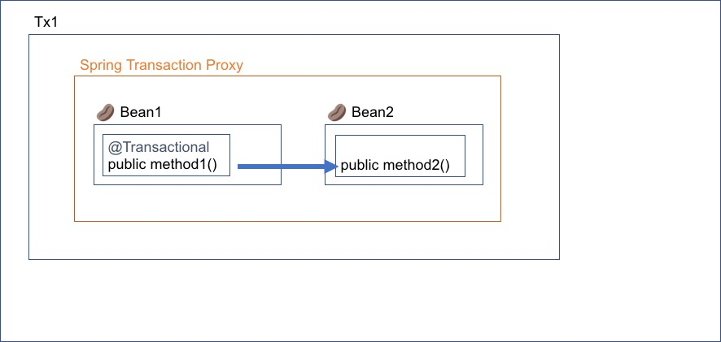

<ol>
<li style="font-size: 70%; color:white;">미리 시작된 트랜잭션이 있을 때 참여한다</li>
<li style="font-size: 70%; color:white;">Bean2 는 별도의 Proxy 로 진행되지 않는다</li>
<li style="font-size: 70%; color:white;">method2 에서 Exception 이 발생해도 catch 만 하면 Rollback 되지 않는다</li>
</ol>

---

+++?code=src/test/java/com/sungmook/transaction/implicit_transaction/TransactionTest.java&lang=java&title=REQUIRED @Transactional

@[52-57](try-catch 로 postService 에 발생한 RuntimeException 을 잡으면 Rollback 되지 않는다)

---

### SUPPORTS

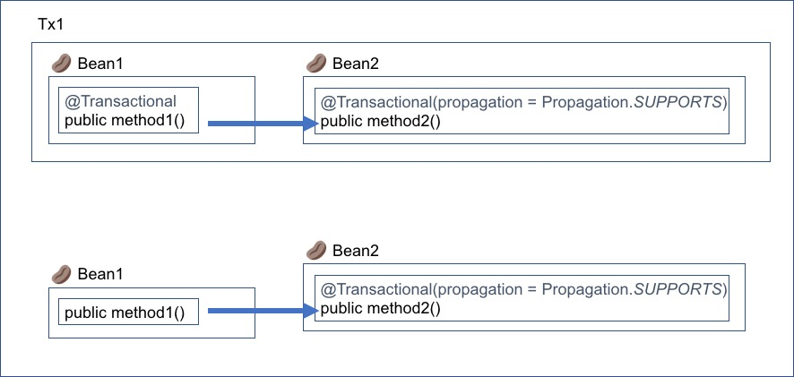

<ol>
<li style="font-size: 70%; color:white;">미리 시작된 트랜잭션이 있으면 참여하고 없으면 트랜잭션 없이 실행된다</li>
<li style="font-size: 70%; color:white;">트랜잭션은 없지만 EntityManager, Connection 은 공유된다</li>
</ol>

---

### REQUIRES_NEW

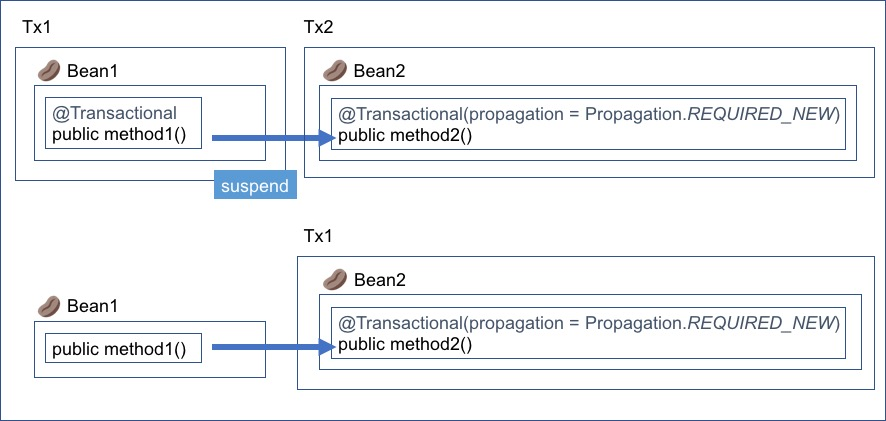

<ol>
<li style="font-size: 70%; color:white;">항상 새로운 트랜잭션을 시작한다</li>
<li style="font-size: 70%; color:white;">이미 진행중인 트랜잭션은 보류(suspend) 시킨다(Holder 에서 제거)</li>
<li style="font-size: 70%; color:white;">method1 에서 Exception 이 발생해 롤백해도 method2 는 롤백하지 않는다</li>
</ol>

+++?code=src/test/java/com/sungmook/transaction/propagation_new/TransactionTest.java&lang=java&title=REQUIRES_NEW @Transactional

@[102-108](userService 에서 예외가 발생해도 postService 데이터는 보존됨)
@[113-119](postService 에서 예외가 발생해도 userService 데이터는 보존됨)

---

### NOT_SUPPORTED

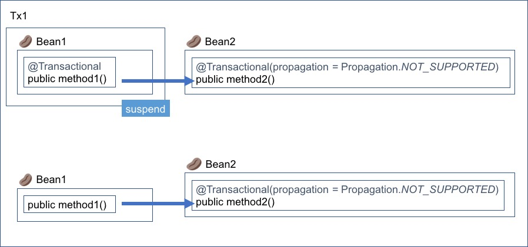

<ol>
<li style="font-size: 70%; color:white;">어떠한 경우에도 트랜잭션 없이 진행한다</li>
<li style="font-size: 70%; color:white;">이미 진행중인 트랜잭션은 보류(suspend) 시킨다(Holder 에서 제거)</li>
</ol>

---

### MANDATORY

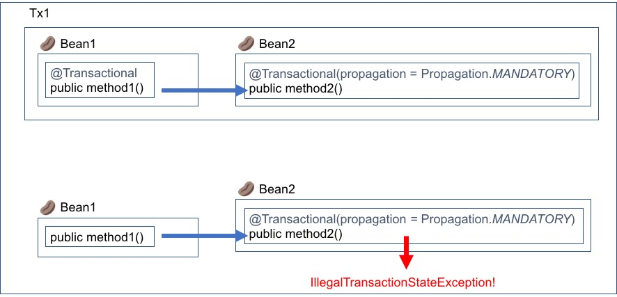

<ol>
<li style="font-size: 70%; color:white;">트랜잭션 없이 실행되면 Exception 을 발생시킨다</li>
</ol>


---

### NEVER

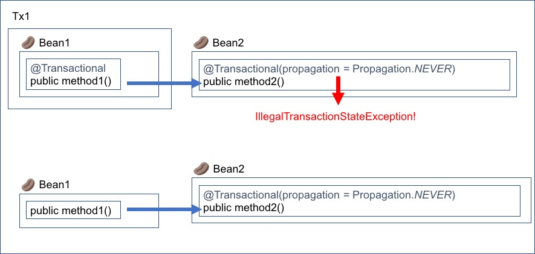

<ol>
<li style="font-size: 70%; color:white;">트랜잭션 내에서 실행되면 Exception 을 발생시킨다</li>
</ol>


---

### NESTED


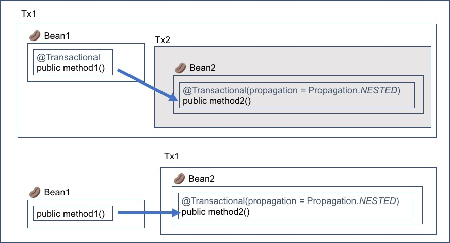

<ol>
<li style="font-size: 70%; color:white;">Hibernate 에선 지원하지 않음</li>
<li style="font-size: 70%; color:white;">외부 트랜잭션에 속한 내부 트랜잭션 생성</li>
<li style="font-size: 70%; color:white;">외부 트랜잭션에 SavePoint 를 두고 Rollback 시 SavePoint 를 원복</li>
<li style="font-size: 70%; color:white;">외부 트랜잭션이 종료돼야 내부 트랜잭션도 commit</li>
</ol>


---
### 알쏭달쏭했던 장애 ( 실제 운영중이었던 서비스 코드 )
```java
public void startLock(Long gluServerId) {
    boolean isPossible = false;

    do {
        int lock = lockRepository.isPossible(gluServerId);
        isPossible = (lock == 0);
        if (isPossible) {
            break;
        }
        Thread.sleep(1000);
    } while(!isPossible);

    lockRepository.locking(gluServerId);
}
```

@[1](@Transaction 이 없으면 외부 트랜잭션에 편승함. 위 startLock 이 다양한 곳에서 호출되었는데, 트랜잭션이 있는 곳도 있고 없는 곳도 있었음)
@[3-11](DB 를 MySQL 을 사용하고 있었는데, MySQL 기본 Isolation 인 Repeatable-read 로 트랜잭션이 실행됐을 때 위 메소드가 종료되지 않아 장애가 몇번 일어남)

---

### readOnly

1. readOnly 는 Connection.setReadOnly(true) 를 호출한다
1. DB에 보내는 Hint 일 뿐이며 설정되어 있어도 Writable 할 수도 있다

+++?code=src/test/java/com/sungmook/transaction/read_only/TransactionTest.java&lang=java&title=ReadOnly

@[54-65](여기서 트랜잭션이 시작되면 read-only. 하지만 외부 트랜잭션에서 실행되면 ignore 된다)
@[36-96]()
---

### @Async

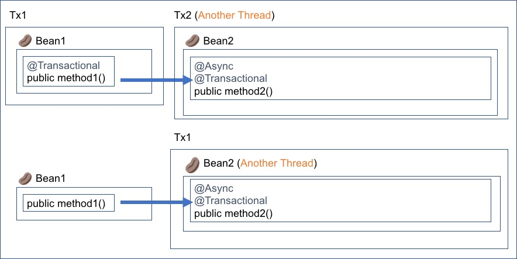

<ol>
<li style="font-size: 70%; color:white;">다른 쓰레드에서 트랜잭션이 실행된다</li>
<li style="font-size: 70%; color:white;">REQUIRED_NEW 와 유사하지만 호출한 트랜잭션이 Suspend 되지 않는 점이 다름</li>
</ol>

+++?code=src/test/java/com/sungmook/transaction/async/TransactionTest.java&lang=java&title=@Async

@[50,53,56](UserService.save 트랜잭션에서 User 를 저장한다)
@[69](PostService.save 는 Async 하게 실행)
@[73-74](UserService.save 에서 저장된 User 객체를 저장하면 실제 DB 에 반영되어 있지 않기 때문에 Exception 발생함)


---
### @Async + TransactionSynchronizationManager

- 실제 TransactionManager 에서 내부적으로 사용되는 TransactionSynchronizationManager 를 통해 직접 제어
- commit 된 후 실행될 callback 을 등록할 수 있다

+++?code=src/test/java/com/sungmook/transaction/async_sync_manager/TransactionTest.java&lang=java&title=@Async + TransactionSynchronizationManager

@[54-62](현재 쓰레드의 트랜잭션 commit 후 Callback 을 실행한다)

---

### @Async + @TransactionalEventListener

- Spring 4.2 부터 트랜잭션 관련 이벤트를 지원
- 코드에 트랜잭션 관련 로직을 제거하고 AOP 로 깔끔하게 코딩 가능
- Publisher 에 Event 를 Emit 하면 트랜잭션이 Commit 되었을 때 해당 Event 를 Listen 하던 메소드가 실행된다

+++?code=src/test/java/com/sungmook/transaction/async_transaction_event/TransactionTest.java&lang=java&title=@Async + @TransactionalEventListener

@[56-60](Emit 하지만 실제 이 시점에 다른 메소드가 수행되진 않는다)
@[68-72](Interface 에 @Async 와 @TransactionalEventListener 그리고 메소드 인자로 해당 Event 가 있어야한다)
@[81-84](Event Payload 로부터 데이터를 꺼내와서 비지니스 로직 실행)

---


### Non-Proxy call

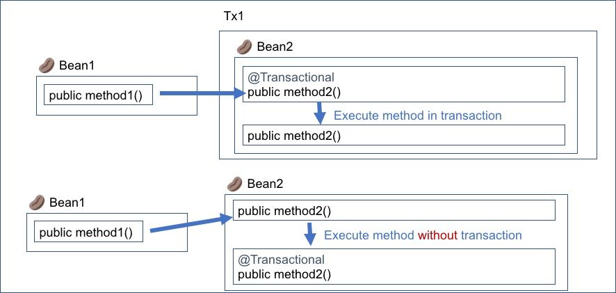

<ol>
<li style="font-size: 70%; color:white;">간단하지만 자주 헷갈리는 부분</li>
<li style="font-size: 70%; color:white;">Spring AOP Proxy 는 Interface 를 통해서만 Proxy 를 실행한다</li>
<li style="font-size: 70%; color:white;">즉, Annotation 이 무시될 수 있으니 주의할 것!</li>
</ol>

---

## 감사합니다