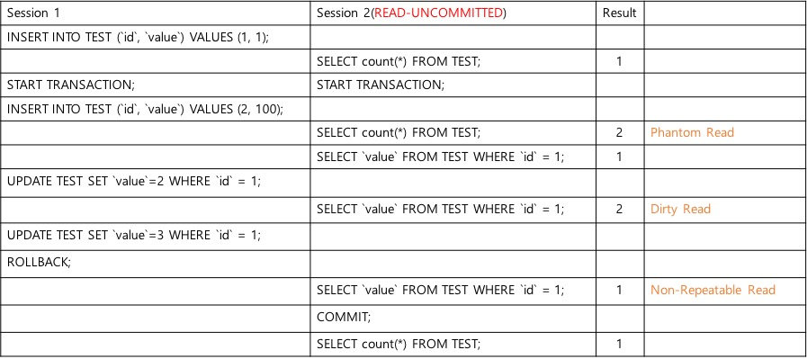

## Spring @Transactional
##### <span style="font-family:Helvetica Neue; font-weight:bold">Deep Dive into <span style="color:#e49436">@Transactional</span> </span>

---


#### 사전지식 - Quiz
##### MySQL 쿼리 실행 결과를 맞춰주세요


1. 1, 2, 2, 3
1. 1, 2, 1, 1
1. 1, 2, 1, 3
1. 1, 1, 1, 3
1. 정답 없음


+++

1. 1, 2, 2, 3 ( Read-Uncommitted )
1. 1, 2, 1, 1 ( 정답 )
1. 1, 2, 1, 3 ( Read-Committed )
1. 1, 1, 1, 3 ( ??? )
1. 정답 없음 ( ㅋ )

---


### ANSI Isolation Levels

| Isolation level | Dirty reads | Non-repeatable reads | Phantoms | Read Operation
| ---- | :---- | :----: | :---: | :----: | :---- |
| Read Uncommitted | may occur   | may occur |  may occur   | not used
| Read Committed     | don't occur | may occur |  may occur   | during statement
| Repeatable Read     | don't occur | don't occur |  may occur  | until commit
| Serializable              | don't occur  | don't occur |  don't occur | until commit

- ANSI 표준에서의 네 가지 Isolation
- 성능 : 위에서 아래 방향 순서로 좋다
- 안정성 : 아래에서 위 방향 순서로 동시 작업에서 안정성을 보장한다

+++

### Isolation - Read Uncommitted
Read Uncommitted - 트랜잭션 시작과 종료 사이에 CUD 가 발생했을 때, 즉 commit 하지 않고 실제 DB 에 반영되지 않았더라도 다른 세션에서 *변경중인 데이터*를 읽을 수 있다. 트랜잭션이 시작되면 commit 명령을 날리기 전엔 변경사항들이 snapshot 에 저장이 되는데, 이 snapshot 에 있는 데이터를 읽을 수 있다는 의미다. 아래 예제를 보자.





+++

### Isolation - Read Committed

Read Committed - 트랜잭션 시작과 종료 사이에 CUD 가 발생해도 다른 세션에선 트랜잭션 시작 전의 데이터를 읽어온다. 즉, 아무리 데이터를 변경해도 이 데이터는 snapshot 에만 있기 때문에 다른 세션에선 트랜잭션의 유무는 무시하고 실제 DB 에 있는 데이터만 읽어오게 된다.


+++

### Isolation - Repeatable Read

마치 cache 처럼, 한 트랜잭션 안에서 select 를 몇 번을 하더라도 동일한 데이터가 나온다. 그럼 Phantom Read 도 해당이 안되는 것 아닌가? 다른 세션에서의 UPDATE 시에는 확실하게 동일한 read 를 보장하지만 다른 세션에서 insert 했을 경우엔 select 시 다른 count 가 나오게 된다.


+++

### Isolation - Serializable

가장 강력한 안정성을 갖고 있다.


---

## Spring Dynamic Proxy


---


## JDBC Transaction
```java
try {
    dbConnection.setAutoCommit(false);

    //SQL insert statement
    //SQL update statement
    //SQL delete statement

    dbConnection.commit();
} catch (SQLException e) {
    dbConnection.rollback();
} finally {
    dbConnection.close();
}
```

---


## TransactionTemplate

```java
public class TransactionTemplate {
    ...
    @Override
    public <T> T execute(TransactionCallback<T> action) throws TransactionException {
        if (this.transactionManager instanceof CallbackPreferringPlatformTransactionManager) {
            return ((CallbackPreferringPlatformTransactionManager) this.transactionManager).execute(this, action);
        }
        else {
            TransactionStatus status = this.transactionManager.getTransaction(this);
            T result;
            try {
                result = action.doInTransaction(status);
            }
            catch (RuntimeException ex) {
                // Transactional code threw application exception -> rollback
                rollbackOnException(status, ex);
                throw ex;
            }
            catch (Error err) {
                // Transactional code threw error -> rollback
                rollbackOnException(status, err);
                throw err;
            }
            catch (Throwable ex) {
                // Transactional code threw unexpected exception -> rollback
                rollbackOnException(status, ex);
                throw new UndeclaredThrowableException(ex, "TransactionCallback threw undeclared checked exception");
            }
            this.transactionManager.commit(status);
            return result;
        }
    }
    ...
}
```
Spring 에서 DI 된 transactionManager 로부터 트랜잭션을 가져온다
콜백 클래스의 doInTransaction 을 실행한다
Exception 발생 시 롤백을 진행한다
Exception 이 발생하지 않았으면 commit 한다

+++?code=src/test/java/com/sungmook/transaction/template/TransactionTest.java&lang=java&title=TransactionTemplate

사용 예제

---

##  @Transactional

+++?code=src/test/java/com/sungmook/transaction/simple/TransactionTest.java&lang=java&title=Simple @Transactional

스프링 컨테이너가 초기화 되는 시점에 @Transactional 포인트컷으로 Proxy 가 생성된다

---

### @Transactional 이 갖는 두 개의 Life Cycle
- Database Transaction
  1. @Transactional 어노테이션은 하나의 DB 트랜잭션 범위를 정의한다
  1. DB 트랜잭션은 Persistent Context 내에서 수행된다
- Persistence Context
  1. Persistence Context 는 하나의 EntityManager 로 수행되는 범위다
  1. (EntityManager 는 내부적으로 하나의 하이버네이트 Session 을 사용함)
  1. 자바 오브젝트의 변화를 추적하고 변경된 내용을 DB 에 반영하는 역할을 수행함
  1. 컨텍스트에 여러개의 DB 트랜잭션이 있을 수 있다(open-in-view, PersistenceContextType.EXTENDED)


---------

### EntityManager

- Hibernate 를 Provider 로 사용한다면 1:1로 Session 을 갖고있다
- 실제 수행은 SharedEntityManagerInvocationHandler 를 통해 Proxy 로 수행된다
- EntityManagerFactory 에 의해 트랜잭션 당 하나가 만들어진다
- Session 은 SessionFactory 에 의해 생성되며 DataSource 를 통한 Connection 을 갖고있다


---

### Transaction Manager

두 가지 책임을 갖고 있다
1. 새로운 EntityManager 를 생성할 것인가, 아니면 Share 해서 사용할 것인가
1. 새로운 DB 트랜잭션을 시작해야 하는가?

- Transaction Aspect 의 'before' 에서 호출되어 위 사항을 결정한다

트랜잭션이 시작되면 다음을 진행한다
1. 새로운 EntityManager 를 만든다
1. EntityManager 를 지금 속한 쓰레드에 Bind 한다
1. DB Connection pool(DataSource)로부터 Connection 을 가져온다
1. Connection 을 현재 쓰레드에 Bind 한다

- 쓰레드에 bind 한다는 의미는 ThreadLocal 에 두 객체(EntityManager, Connection)을 저장한다는 의미
- TransactionSynchronizationManager 의 ThreadLocal Property 로 저장
- EntityManager Proxy(SharedEntityManagerInvocationHandler에서 invoke) 에서도 공유해서 사용

---

### Transaction Aspect ( TransactionInterceptor )

@Transactional 이 설정된 Method 를 around 로 invoke 한다
비즈니스 로직 수행 전(before) 에 새로운 트랜잭션을 수행할지, 기존 트랜잭션에 합류할지 정한다(TransactionManager 에 위임)
비즈니스 로직 수행 후(after) 에 트랜잭션을 commit 할지 rollback 할지 결정한다

---

### Holders

- EntityManagerHolder, ConnectionHolder
- 쓰레드에서 공유(Share) 해서 사용하는 EntityManager, Connection 를 담아두는 홀더
- Propagation.REQUIRED_NEW, SUPPORTS 에선 두 홀더에서 데이터를 잠시 제거한다
- Open-in-view Interceptor 에서 하는 일은 미리 Holder 를 설정해놓고 Request 종료될때 제거함

---

### @EnableTransactionManagement

- Annotation 으로 설정된 @Transactional 을 활성화한다
- 기본은 Spring Proxy AOP, 즉 JDK 기본 Interface AOP 를 제공한다(설정으로 AspectJ 가능)
- 내부 클래스 흐름은 @EnableTransactionManagement -> TransactionManagementConfigurationSelector -> ProxyTransactionManagementConfiguration -> BeanFactoryTransactionAttributeSourceAdvisor
에서 PointCut 에 해당하는 @Transactional 정보를 갖고 있는 AnnotationTransactionAttributeSource 와 실제 Advice 를 수행하는 TransactionalInterceptor 가 Advisor 수행된다


---

### Open In View
Hibernate 에선 Open Session In View 라고 하지만 JPA 에선 EntityManager 를 사용하기 때문에 OpenEntityManagerInView 라고 함. (JpaBaseConfiguration 참고)

쓰레드 마다 EntityManager 가 새롭게 생성된다. 각 Entity 도 실제로는 HibernateProxy 를 중간에 놓고 작업을 진행하게 되는데, 이때 만약 LazyLoading 이 걸려 있다면 어떻게 될까? 사용자의 친구들을 갖고 오는 메소드가 있을 때 관계를 가져오는 user.getFriends() 메소드는 이 Proxy 에 의해서 실제 불러들일 때만 DB 에서 Select 를 하게 된다. 이때 생성된 Proxy 에서 사용하는 게 현재 쓰레드에 바인딩 된 EntityManager 의 getReference(Friend.class, PK) 이다. 트랜잭션이 종료되면 EntityManager 는 Close 되게 되는데, 이래서 트랜잭션 외부에서 관계가 설정된 데이터를 읽어올 때 LazyInitializationException 이 뜨게 되는 것이다.
그럼 OpenInView 옵션이 켜져 있으면 어떨게 될까?
OpenInView 가 켜져있으면 OpenEntityManagerInViewInterceptor 가 등록된다. 이 인터셉터는 요청(request) 시작 전에 미리 직접 EntityManager 를 생성하고 EntityManagerHolder 에 이 엔티티 매니저를 넣어놓는다. 이 홀더는 실제 트랜잭션 매니저에서 그대로 활용된다. 요청이 종료되면 여기서 생성한 EntityManager 를 반환한다.


---

## Application Transaction Propagation

- REQUIRED ( default )
- SUPPORTS
- MANDATORY
- REQUIRES_NEW
- NOT_SUPPORTED
- NEVER
- NESTED

---

### REQUIRED


1. 미리 시작된 트랜잭션이 있으면 참여하고 없으면 새로 시작한다
1. Spring 기본이며 대부분의 케이스엔 REQUIRED 면 충분하다
1. 어디서든 Exception 이 발생하면 전체가 롤백된다

+++?code=src/test/java/com/sungmook/transaction/simple/TransactionTest.java&lang=java&title=REQUIRED @Transactional

@[52-57] try-catch 로 postService 에 발생한 RuntimeException 을 잡더라도 전체가 Rollback 된다

+++


1. 미리 시작된 트랜잭션이 있을 때 참여한다
1. Bean2 는 별도의 Proxy 로 진행되지 않는다
1. method2 에서 Exception 이 발생해도 catch 만 하면 Rollback 되지 않는다

+++?code=src/test/java/com/sungmook/transaction/implicit_transaction/TransactionTest.java&lang=java&title=REQUIRED @Transactional


@[52-57] try-catch 로 postService 에 발생한 RuntimeException 을 잡으면 Rollback 되지 않는다

---

### SUPPORTS


- 미리 시작된 트랜잭션이 있으면 참여하고 없으면 트랜잭션 없이 실행된다
- 트랜잭션은 없지만 EntityManager, Connection 은 공유된다

---

### REQUIRES_NEW


- 항상 새로운 트랜잭션을 시작한다
- 이미 진행중인 트랜잭션은 보류(suspend) 시킨다(Holder 에서 제거)
- method1 에서 Exception 이 발생해 롤백해도 method2 는 롤백하지 않는다

+++?code=src/test/java/com/sungmook/transaction/propagation_new/TransactionTest.java&lang=java&title=REQUIRED @Transactional

@[102-108] userService 에서 예외가 발생해도 postService 데이터는 보존됨
@[113-119] postService 에서 예외가 발생해도 userService 데이터는 보존됨

---

### NOT_SUPPORTED


- 어떠한 경우에도 트랜잭션 없이 진행한다
- 이미 진행중인 트랜잭션은 보류(suspend) 시킨다(Holder 에서 제거)

---

### MANDATORY

- 트랜잭션 없이 실행되면 Exception 을 발생시킨다


---

### NEVER


- 트랜잭션 내에서 실행되면 Exception 을 발생시킨다


---

### NESTED


- Hibernate 에선 지원하지 않음
- 외부 트랜잭션에 속한 내부 트랜잭션 생성
- 외부 트랜잭션에 SavePoint 를 두고 내부 트랜잭션에서 Rollback 시 SavePoint 를 원복
- 외부 트랜잭션이 종료돼야 내부 트랜잭션도 commit


---
### 알쏭달쏭했던 장애 ( 실제 운영중이었던 서비스 코드 )
```java
public void startLock(Long gluServerId) {
    boolean isPossible = false;

    do {
        int lock = lockRepository.isPossible(gluServerId);
        isPossible = (lock == 0);
        if (isPossible) {
            break;
        }
        Thread.sleep(1000);
    } while(!isPossible);

    lockRepository.locking(gluServerId);
}
```

@[1](@Transaction 이 없으면 외부 트랜잭션에 편승함. 위 startLock 이 다양한 곳에서 호출되었는데, 트랜잭션이 있는 곳도 있고 없는 곳도 있었음)
@[4-5, 11](DB 를 MySQL 을 사용하고 있었는데, MySQL 기본 Isolation 인 Repeatable-read 로 트랜잭션이 실행됐을 때 위 메소드가 종료되지 않아 장애가 몇번 일어남)

---

### @Async


- 다른 쓰레드에서 트랜잭션이 실행된다
- REQUIRED_NEW 와 유사하지만 호출한 트랜잭션이 Suspend 되지 않는 점이 다름

+++?code=src/test/java/com/sungmook/transaction/async/TransactionTest.java&lang=java&title=@Async

@[50,53,56](UserService.save 트랜잭션에서 User 를 저장한다)
@[69](PostService.save 는 Async 하게 실행)
@[73-74](UserService.save 에서 저장된 User 객체를 저장하면 실제 DB 에 반영되어 있지 않기 때문에 Exception 발생함)


---
### @Async + TransactionSynchronizationManager

- 실제 TransactionManager 에서 내부적으로 사용되는 TransactionSynchronizationManager 를 통해 직접 제어
- commit 된 후 실행될 callback 을 등록할 수 있다

+++?code=src/test/java/com/sungmook/transaction/async_sync_manager/TransactionTest.java&lang=java&title=@Async

@[54-62] 현재 쓰레드의 트랜잭션 commit 후 Callback 을 실행한다

------------------------

### @Async + @TransactionalEventListener

- Spring 4.2 부터 트랜잭션 관련 이벤트를 지원
- 코드에 트랜잭션 관련 로직을 제거하고 AOP 로 깔끔하게 코딩 가능
- Publisher 에 Event 를 Emit 하면 트랜잭션이 Commit 되었을 때 해당 Event 를 Listen 하던 메소드가 실행된다

+++?code=src/test/java/com/sungmook/transaction/async_transaction_event/TransactionTest.java&lang=java&title=@Async

@[56-60] Emit 하지만 실제 이 시점에 다른 메소드가 수행되진 않는다
@[68-72] Interface 에 @Async 와 @TransactionalEventListener 그리고 메소드 인자로 해당 Event 가 있어야한다
@[81-84] Event Payload 로부터 데이터를 꺼내와서 비지니스 로직 실행

-------------------


### Non-Proxy call


- 간단하지만 자주 헷갈리는 부분
- Spring AOP Proxy 는 Interface 를 통해서만 Proxy 를 실행한다
- 즉, Annotation 이 무시될 수 있으니 주의할 것!